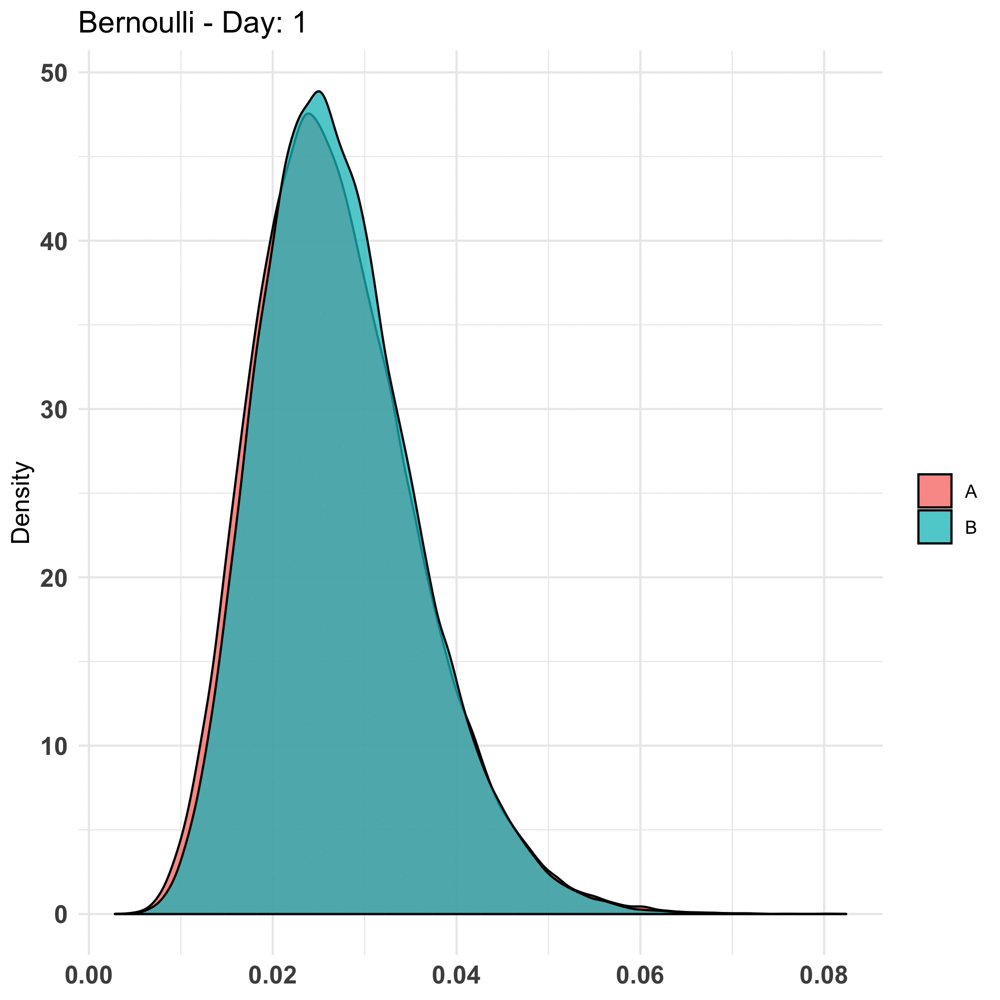
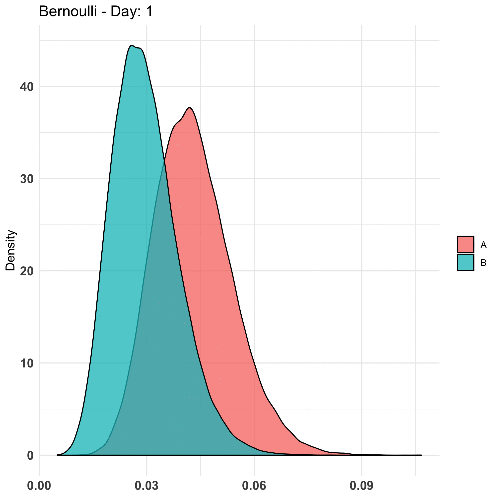
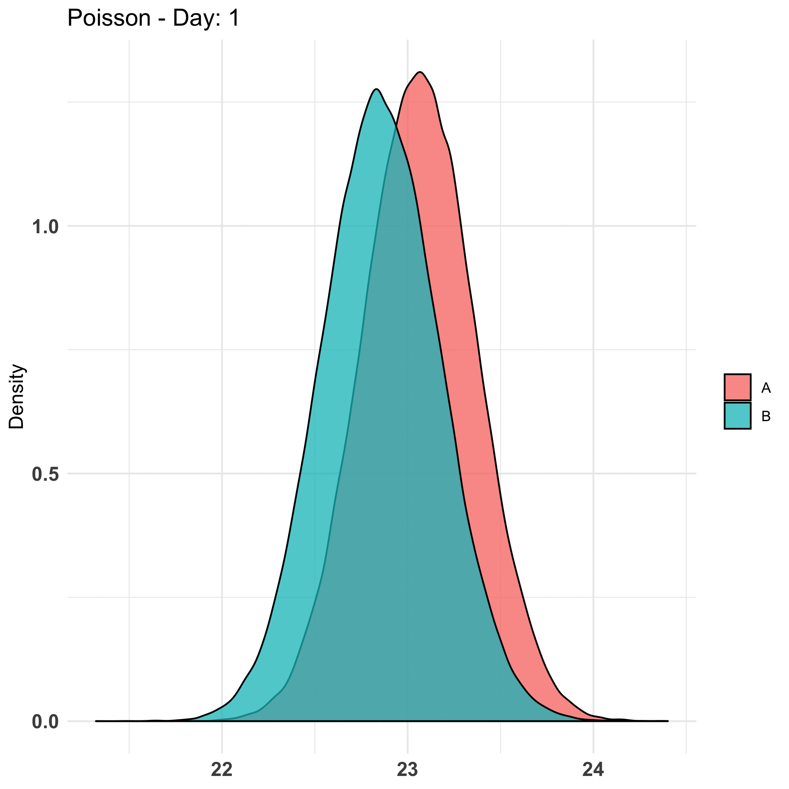
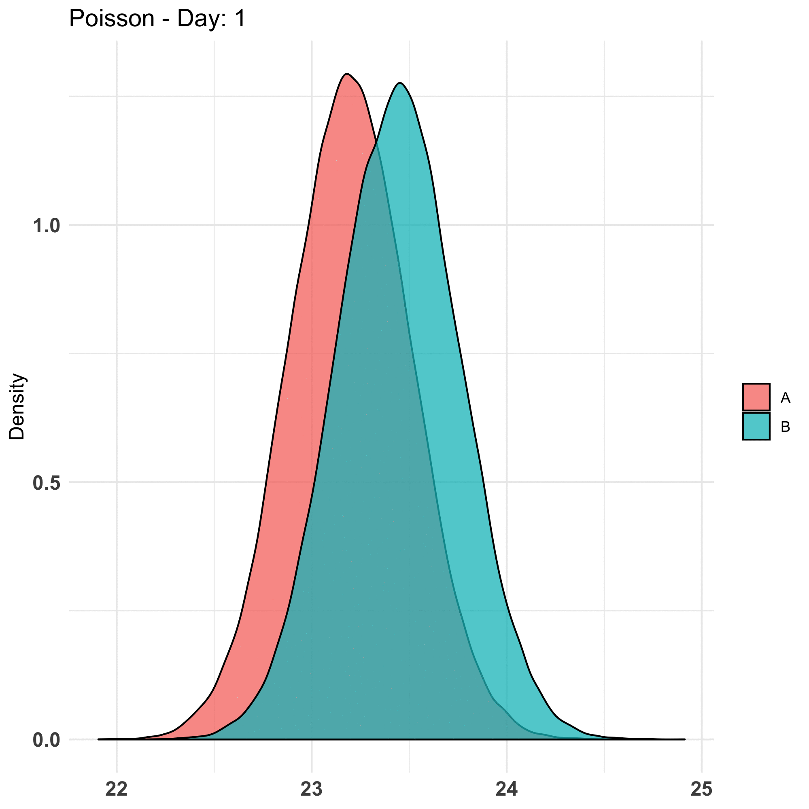
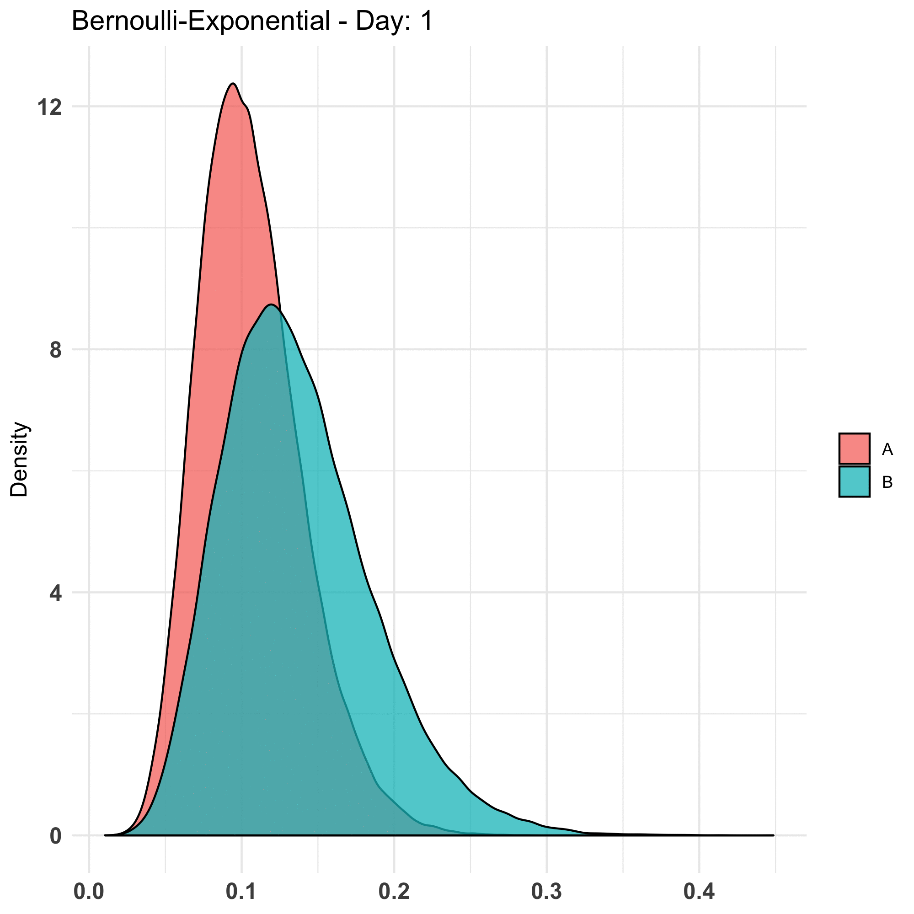
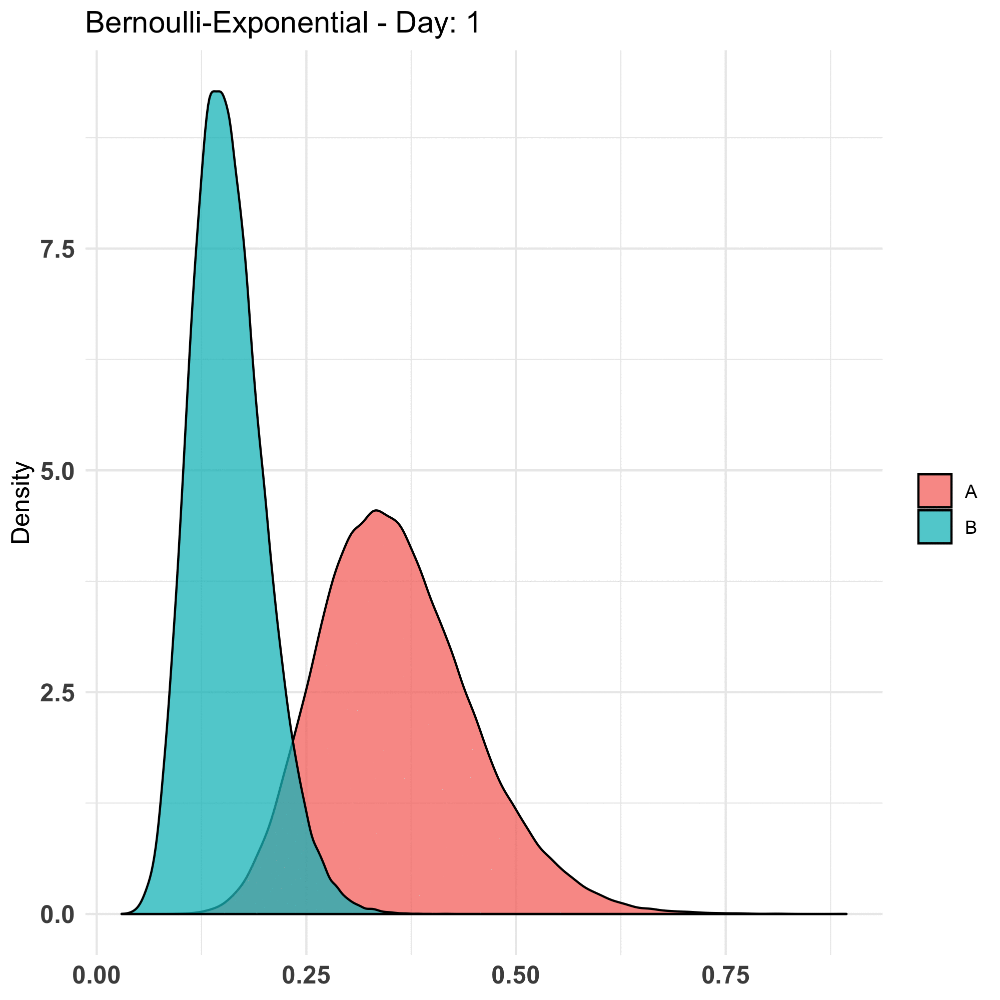

# Bayesian A/B Testing

Comparison of Bayesian A/B Testing to Frequentist A/B Testing on:

* Effect of peeking
* Effect of sample size
* Effect of prior parameter selection

# Parameter Space

* nreps: 500 (100 for bernoulli-exponential due to limited memory)
* days (of experiment): 30
* Parameter Selection: [Directional, Confident, Wrong, (Neutral)]
* sample_size_per_day: [500, 5000, 50000] (50000 excluded for bernoulli-exponential due to limited memory)
* threshold (of caring): [0.1, 0.01, 0.001, 0.0001, 0.00001]

# Summary

In real applications, Bernoulli is a good distribution for payer conversion, Poisson is a good distribution for count data, (e.g. how many moves a user makes in mobile game) and Bernoulli-Exponential is a good distribution for revenue data (once a user becomes a payer it's reasonable to assume the spend is right skewed). 

| Case ID | Application      | Distribution          | Effect  |
| ------- | ---------------- | --------------------- | ------- |
| 1       | Payer Conversion | Bernoulli             | False   |
| 2       | Payer Conversion | Bernoulli             | True    |
| 3       | Total Moves      | Poisson               | False   |
| 4       | Total Moves      | Poisson               | True    |
| 5       | Revenue          | Bernoulli-Exponential | False   |
| 6       | Revenue          | Bernoulli-Exponential | True    |


| Case ID | Peeking | Sample Size | Parameter Selection |
| ------- | ------------------------------------------------- | ----------------- | ------------------- |
| 1       | Suffer but not as badly as frequentist  	 | Sensitive   | Insensitive         |
| 2       | Suffer but not as badly as frequentist      | Sensitive     | Insensitive         |
| 3       | Suffer but not as badly as frequentist      | Sensitive     | Insensitive         |
| 4       | Suffer but not as badly as frequentist      | Sensitive      | Insensitive         |
| 5       | Suffer but not as badly as frequentist      | Sensitive      | Insensitive         |
| 6       | Suffer but not as badly as frequentist      | Sensitive    | Insensitive         |

# Details

### Case 1



### Case 2



### Case 3



### Case 4



### Case 5



### Case 6



# Conclusions

* Bayesian A/B testing can be used to speed up experimentation not by shortening the duration but by requiring much less samples to achieve a comparable performance as Frequentist A/B testing framework.
	* Bayesian false positive rate also suffers from peeking
	* In Frequentist, the more samples the better. It's not necessarily true in Bayesian. You *can* have too many samples!
* Prior parameter selection does not pose a challenge in real applications (at least for the closed-form cases we explored).
* Threshold of caring differs from problem to problem, so it could potentially be abused. Simulations involved in this analysis may suggest a good choice.

# Trouble Shoot

Vector Allocation Error

```
$ cd ~
$ touch .Renviron
$ open .Renviron

R_MAX_VSIZE=100Gb
```